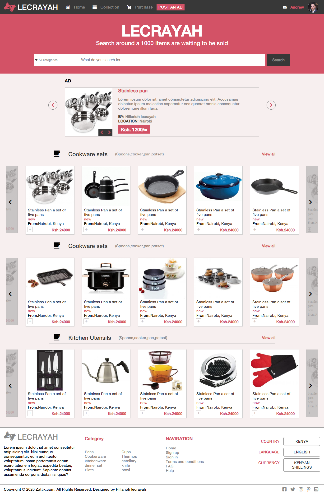

# lecrayah-ecommerce

HTML CAPSTONE PROJECT

## Video presentation

[Video Link](https://www.loom.com/share/41da4a9d207d4137b766e721eb086b8a)

Index page

Search page

## Built With

- HTML 5 and CSS 3.
- SCSS
- Font Awesome
- Materialize
- Javascript

## Live Demo

[Live Demo Link](https://raw.githack.com/hillarioh/lecrayah-ecommerce/lecrayah/index.html)

## Getting Started

**Just fork it and fell free to use it.**

To get a local copy up and running follow these simple example steps.

### Prerequisites

Having a web browser, code editor and git.

### Install

Just fork it and you are good to go.

## Author

👤 **Hillarioh Okerio**

- Github: [@hillarioh](https://github.com/hillarioh)
- Twitter: [@hillaokri](https://twitter.com/hillaokri)
- Linkedin: [Hillarioh Okerio](www.linkedin.com/in/hillaryokerio)
- Email: (okerioh@gmail.com)

## 🤝 Contributing

Contributions, issues and feature requests are welcome!

Feel free to check the [issues page](https://github.com/hillarioh/Newsweek.com-clone/issues).

## Show your support

Give a ⭐️ if you like this project!

## 📝 License

This project is [MIT](./LICENSE) licensed.
